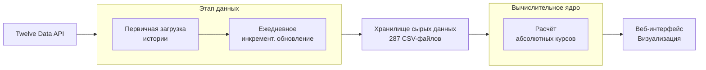
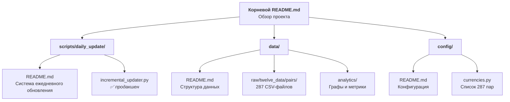

# AbsCur3: Веб-платформа абсолютных валютных курсов

+

**AbsCur3** — третья расширенная версия проекта «Абсолютные валютные курсы», платформа для вычисления и визуализации валютных курсов на единой абсолютной шкале. Проект развивает концепцию, представленную в [AbsCur2](https://www.kaggle.com/code/eavprog/abscur2), увеличивая охват до **153 валют** и **287 валютных пар**.

## 🎯 О проекте

AbsCur3 преобразует традиционные парные валютные курсы в **абсолютную шкалу значений**, где каждая валюта получает уникальный числовой показатель, подобный температуре в шкале Кельвина. Это позволяет напрямую сравнивать любые валюты без посредничества третьей валюты.

**Ключевой принцип**: AbsCur3 — это проект об **абсолютных валютных курсах**, а не публичный архив сырых парных котировок. Сырые данные являются промежуточным продуктом для внутренних расчётов и поддерживаются в актуальном состоянии автоматизированной системой.

## 🎯 Текущий статус проекта

**✅ Система ежедневного обновления работает в продакшене с 02.02.2026**

- **🔄 Ежедневное обновление:** 287 валютных пар в 05:00 UTC
- **⏱️ Время выполнения:** 41 минута (автоматический запуск)
- **📊 Объём данных:** 1,930,237 записей, растёт на ~287 записей/день
- **🎯 Следующий этап:** Разработка алгоритма расчёта абсолютных курсов

## 🏗️ Общая архитектура проекта

Проект реализует сквозной пайплайн от загрузки сырых данных до веб-визуализации.

**Источник данных**: [Twelve Data API](https://twelvedata.com)
**Алгоритм расчёта**: Метод наименьших квадратов для системы из 287 уравнений
**Размещение**: Веб-интерфейс останется на центральном сайте проекта http://www.abscur.ru

## 🔄 Автоматизация и поддержка данных

Для поддержания работоспособности ядра проекта реализована **система ежедневного инкрементального обновления**.

**Цель**: Автоматически поддерживать актуальность и целостность сырых данных для 287 валютных пар.
**Ключевые особенности**:
*   **Ежедневный автономный запуск** через GitHub Actions (05:00 UTC)
*   **Инкрементальная загрузка** с перекрытием 5 дней для выравнивания истории
*   **Соблюдение лимитов API** (8 запросов в минуту)
*   **Идемпотентность и устойчивость** к ошибкам

**🚀 Продакшен-результаты (02.02.2026):**
*   Время выполнения: 41 минута
*   Обработано пар: 287/287
*   Новых записей: 287
*   Ошибок: 0
*   Статус: ✅ Полностью автоматизированная система

📚 **Подробная документация**: [Система ежедневного обновления](scripts/daily_update/README.md)

## 🌐 Веб-интерфейсы

### Работающая версия (AbsCur2)
**🔗 [www.abscur.ru](https://www.abscur.ru)**
Текущий работающий веб-интерфейс на основе данных AbsCur2 с 45 валютами.

### Разрабатываемая версия (AbsCur3)
**📍 Останется на прежнем месте - [www.abscur.ru](https://www.abscur.ru)**
Расширенный интерфейс с 153 валютами и полным графом из 287 валютных пар.

## 📊 Технические характеристики

| Параметр | Значение | Описание |
|----------|----------|----------|
| **Валютные пары** | 287 | Полный граф связей ([Конфигурация](config/README.md)) |
| **Уникальные валюты** | 153 | Расширенный охват |
| **Глубина истории** | до 20+ лет | С 1979 года для некоторых пар |
| **Алгоритм расчёта** | Метод наименьших квадратов | Система из 287 уравнений |
| **Обновление данных** | Ежедневное, автоматическое | Через GitHub Actions |
| **Размещение** | сайт http://www.abscur.ru | Нулевая стоимость инфраструктуры |

## 📁 Структура и навигация по репозиторию

Проект структурирован с использованием вложенной документации для удобства навигации.

**Основные каталоги**:
*   [`scripts/daily_update/`](scripts/daily_update/README.md) — Система автоматического ежедневного обновления сырых данных.
*   [`data/`](data/README.md) — Хранилище сырых и аналитических данных.
*   [`config/`](config/README.md) — Конфигурация проекта (список 287 валютных пар).
*   `scripts/initial_load/` — Скрипты первичной загрузки исторических данных.

## 🔗 Связанные материалы

### Техническая документация и статьи
- **[Абсолютные валютные курсы: математика, код и практика](https://habr.com/ru/articles/984558/)** — **Новая ключевая статья**. Подробный разбор математической модели (матрицы, МНК, логарифмирование), практической реализации на Python и анализ конкретных примеров (например, USD/JPY). Является техническим ядром, объясняющим переход от парных котировок к абсолютной шкале.
- **[От парных котировок к абсолютным курсам](https://habr.com/ru/articles/983024/)** — подробное описание ETL-процесса и архитектуры загрузки данных.
- **[Теоретические основы метода](https://habr.com/ru/articles/652187/)** — концепция абсолютных валютных курсов.

### Предыдущие версии проекта
- **[AbsCur2 на Kaggle](https://www.kaggle.com/code/eavprog/abscur2)** — вторая версия проекта источника данных с 45 валютами
- **[Веб-интерфейс AbsCur2](https://www.abscur.ru)** — работающая реализация концепции (использует вторую версию источника данных)

## 📋 Статус разработки

| Этап | Статус | Описание |
|------|--------|----------|
| **1. Первичная загрузка истории** | ✅ Завершено | Загружены исторические данные для 287 пар |
| **2. Система ежедневного обновления** | ✅ **Завершено** (02.02.2026) | Автоматический пайплайн работает в продакшене |
| **3. Расчёт абсолютных курсов** | 🎯 **Текущий фокус** | Разработка алгоритмического ядра проекта |
| **4. Веб-интерфейс AbsCur3** | ⏳ В плане | Визуализация на GitHub Pages |

**Текущий фокус**: Разработка алгоритма расчёта абсолютных валютных курсов на основе ежедневно обновляемых данных.

## ⚖️ Правовой статус

AbsCur3 создаёт **производный научно-исследовательский продукт** — абсолютные валютные курсы, вычисленные методом наименьших квадратов на основе данных Twelve Data API. Проект позиционируется как:
1. **Научное исследование** — разработка нового метода измерения валютных ценностей
2. **Образовательный ресурс** — открытая платформа для изучения финансовой математики
3. **Инфраструктурный проект** — предоставление уникальных данных сообществу

## 👤 Автор

**prog815**
- GitHub: [@prog815](https://github.com/prog815)
- Проект: [AbsCur3](https://github.com/prog815/abscur3)

---

- **⭐ Если проект интересен, поставьте звезду на GitHub!**
- **🔔 Следите за обновлениями**: Веб-интерфейс AbsCur3 скоро будет доступен на http://www.abscur.ru.
- **🔔 Следите за обновлениями**: Система ежедневного обновления работает, следующий этап — расчёт абсолютных курсов!

---

- *Проект является развитием исследования «Абсолютный валютный курс»*
*Последнее обновление: Январь 2026*
- *Статус проекта: Активная разработка системы автоматизации данных*
- *Последнее обновление: Февраль 2026*
- *Статус проекта: ✅ Система обновления в продакшене, переход к расчёту абсолютных курсов*
