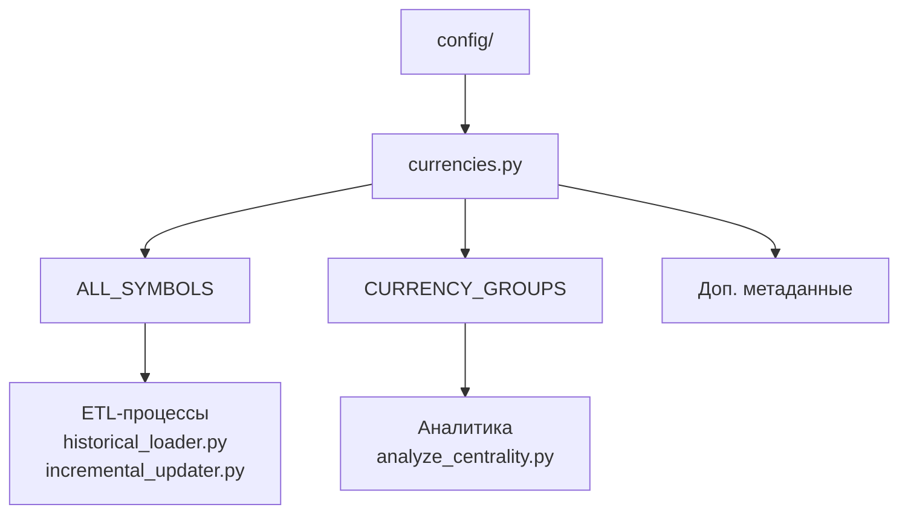
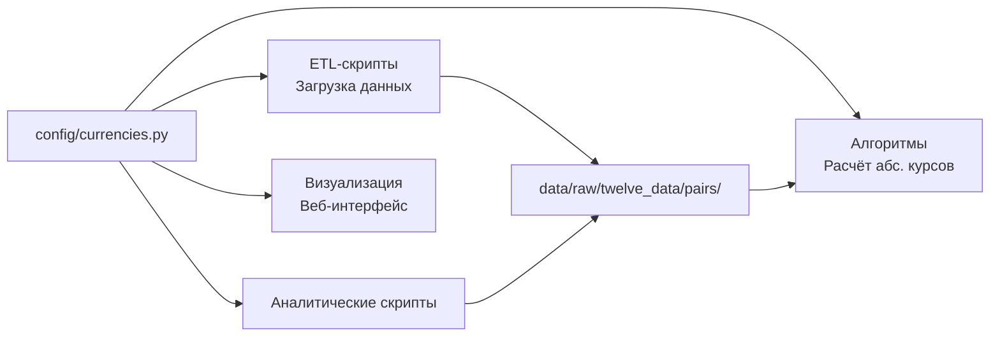

# Конфигурация проекта AbsCur3

[← Назад к корневому README.md](../README.md)

## 🎯 Назначение

Каталог `config/` содержит ключевые конфигурационные файлы, определяющие логику работы проекта AbsCur3. Центральным элементом является файл `currencies.py`, который хранит **полный список из 287 валютных пар** — основу для загрузки данных и последующего расчёта абсолютных курсов.

## 📁 Структура конфигурации



## 📄 Файл `currencies.py`

Этот файл является **единственным источником истины** о списке валютных пар в проекте.

### Основные константы

#### 1. `ALL_SYMBOLS`
*   **Тип**: `list[str]`
*   **Назначение**: Полный перечень из 287 валютных пар для обработки.
*   **Формат**: Список символов в формате `"BAS/QUOTE"` (например, `"EUR/USD"`, `"USD/RUB"`).
*   **Использование**:
    *   Загрузка исторических данных (`historical_loader.py`)
    *   Ежедневное инкрементальное обновление (`incremental_updater.py`)
    *   Будущий расчёт абсолютных курсов

**Пример**:
```python
ALL_SYMBOLS = [
    "EUR/USD",
    "USD/JPY",
    "GBP/USD",
    # ... всего 287 пар
]
```

#### 2. `CURRENCY_GROUPS`
*   **Тип**: `dict[str, list[str]]`
*   **Назначение**: Группировка пар по категориям (Major, Minor, Exotic) для аналитики.
*   **Структура**:
    ```python
    CURRENCY_GROUPS = {
        'Major': ["EUR/USD", "USD/JPY", ...],  # 34 пары
        'Minor': ["AUD/CAD", "EUR/GBP", ...],  # 107 пар
        'Exotic': ["USD/TRY", "EUR/PLN", ...]  # 146 пар
    }
    ```
*   **Использование**:
    *   Анализ центральности валют (`analyze_centrality.py`)
    *   Статистические отчёты
    *   Визуализация графа валют

#### 3. Дополнительные метаданные
Файл также содержит вспомогательные структуры данных для полного описания валют:
*   Информация о базовых и котируемых валютах
*   Полные названия валют
*   Служебные данные для аналитики

## 🔄 Роль в архитектуре проекта

Конфигурационный файл является **связующим звеном** между всеми компонентами системы:



## ⚙️ Использование в коде

### Загрузка конфигурации в Python-скриптах
```python
import sys
import os

# Добавляем каталог config в путь Python
PROJECT_ROOT = os.path.dirname(os.path.dirname(os.path.abspath(__file__)))
sys.path.insert(0, os.path.join(PROJECT_ROOT, 'config'))

# Импортируем конфигурацию
import currencies

# Используем список пар
for symbol in currencies.ALL_SYMBOLS:
    print(f"Обработка пары: {symbol}")

# Используем группы
print(f"Количество мажорных пар: {len(currencies.CURRENCY_GROUPS['Major'])}")
```

### Валидация конфигурации
При запуске ETL-процессов выполняется проверка:
1. **Полнота списка**: ровно 287 пар
2. **Корректность формата**: символы в формате `XXX/YYY`
3. **Согласованность групп**: все пар из `ALL_SYMBOLS` присутствуют в одной из групп

## 📊 Статистика (актуальная)

На основе текущей конфигурации:

| Параметр | Значение | Примечание |
|----------|----------|------------|
| **Всего пар** | 287 | Полный граф связей |
| **Major (мажорные)** | 34 пары | 11.8% |
| **Minor (минорные)** | 107 пар | 37.3% |
| **Exotic (экзотические)** | 146 пар | 50.9% |
| **Уникальных валют** | 145 | Из 153 доступных в проекте |
| **Наиболее центральная** | USD | 115 связей |

## 🛠 Технические детали

### Формат символов
*   Всегда в формате `BAS/QUOTE` (базовая валюта/котируемая валюта)
*   Использует прямую котировку (например, `EUR/USD` = сколько USD за 1 EUR)
*   Символы сохраняются без пробелов

### Взаимодействие с API Twelve Data
Символы из `ALL_SYMBOLS` используются напрямую в запросах к API:
```python
symbol = "EUR/USD"  # Из конфигурации
params = {'symbol': symbol, 'interval': '1day', ...}
response = requests.get(API_URL, params=params)
```

### Миграция и обновление
При добавлении новых пар в проект:
1. Добавить пару в `ALL_SYMBOLS`
2. Определить её группу в `CURRENCY_GROUPS`
3. Запустить историческую загрузку для новой пары
4. Система ежедневного обновления автоматически включит новую пару в обработку

## 🔗 Связанная документация

*   [Корневой README.md](../README.md) — Обзор проекта AbsCur3
*   [Структура данных](../data/README.md) — Описание каталога `data/`, куда загружаются данные для пар из этой конфигурации
*   [Система ежедневного обновления](../scripts/daily_update/README.md) — Процесс, использующий `ALL_SYMBOLS` для поддержания актуальности данных
*   [Статья на Хабре](https://habr.com/ru/articles/983024/) — Подробное описание методологии выбора пар


