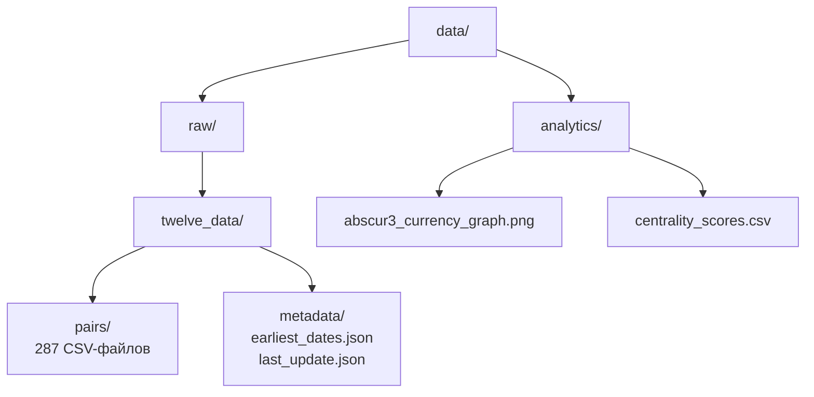
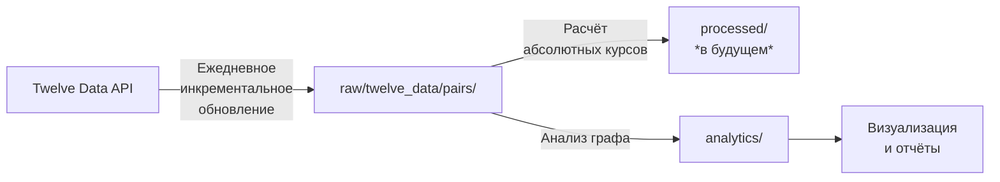

# Структура данных AbsCur3

[← Назад к корневому README.md](../README.md)

## 🎯 Назначение

Каталог `data/` содержит все данные проекта AbsCur3, организованные по принципу разделения на **сырые (raw)** данные и **обработанные (processed)** данные. Сырые данные являются промежуточным продуктом, загружаемым из внешних источников, и служат основой для последующего расчёта абсолютных валютных курсов.

**Ключевой принцип**: AbsCur3 — проект об **абсолютных валютных курсах**, а не публичный архив сырых парных котировок.

## 📁 Общая структура



## 📊 Детальное описание

### 1. Каталог `raw/` — Исходные данные
Содержит данные, полученные напрямую из внешнего API без существенной обработки.

#### `raw/twelve_data/pairs/`
**Назначение**: Хранение исторических дневных котировок для каждой из 287 валютных пар.
*   **Формат файлов**: `AUDUSD.csv`, `EURUSD.csv`, `USDRUB.csv` и т.д. (символ пары без разделителя).
*   **Формат данных (CSV)**:
    ```csv
    datetime,open,high,low,close
    2023-01-01,1.4567,1.4590,1.4521,1.4578
    2023-01-02,1.4579,1.4612,1.4550,1.4595
    ```
*   **Особенности**:
    *   Данные отсортированы по полю `datetime` по возрастанию (от старых к новым).
    *   Отсутствуют дубликаты записей по дате.
    *   Обновляются автоматически [системой ежедневного инкрементального обновления](../scripts/daily_update/README.md).

#### `raw/twelve_data/metadata/`
**Назначение**: Хранение служебной метаинформации для работы ETL-процессов.
*   `earliest_dates.json` — Кэш самых ранних доступных дат для каждой валютной пары по данным API. Используется для оптимизации первичной загрузки.
*   `last_update.json` — Метаданные о последней успешной загрузке.
*   *(Планируется)* `update_state.json` — Файл состояния для отслеживания прогресса ежедневного обновления.

### 2. Каталог `analytics/` — Аналитика и производные данные
Содержит данные, полученные в результате анализа сырых данных.

*   `abscur3_currency_graph.png` — Визуализация графа связей между 153 валютами проекта.
*   `centrality_scores.csv` — Таблица с рассчитанными метриками центральности (степень, посредничество, близость) для каждой валюты в графе.

## 🔄 Жизненный цикл данных



1.  **Загрузка**: Сырые данные загружаются в `raw/twelve_data/pairs/` (разово исторически, затем ежедневно).
2.  **Расчёт** (следующий этап проекта): На основе сырых данных будет производиться расчёт абсолютных курсов, результаты которого планируется размещать в `processed/`.
3.  **Анализ**: На основе сырых данных строятся аналитические отчёты и визуализации в `analytics/`.

## ⚙️ Использование в скриптах

Пути к данным в скриптах проекта задаются относительно корня репозитория (`PROJECT_ROOT`), что обеспечивает переносимость кода.

**Пример из `historical_loader.py`**:
```python
import os
PROJECT_ROOT = os.getcwd()
DATA_DIR = os.path.join(PROJECT_ROOT, 'data', 'raw', 'twelve_data', 'pairs')
CSV_FILE_PATH = os.path.join(DATA_DIR, 'AUDUSD.csv')
```

## 🔗 Связанная документация

*   [Корневой README.md](../README.md) — Обзор всего проекта.
*   [Документация системы ежедневного обновления](../scripts/daily_update/README.md) — Процесс поддержания актуальности данных в `pairs/`.
*   [Конфигурация валютных пар](../config/README.md) — Описание списка из 287 пар, данные о которых хранятся здесь.

