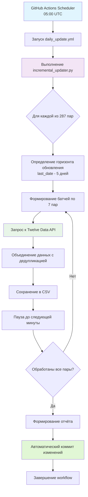

# Система ежедневного инкрементального обновления данных AbsCur3

[← Назад к корневому README.md](../../README.md)


## 📋 Обзор

Система ежедневного инкрементального обновления предназначена для поддержания актуальности сырых данных валютных пар, необходимых для расчёта абсолютных курсов в проекте AbsCur3. Система работает полностью автоматически, выполняясь каждый день в заданное время.

**Ключевой принцип**: AbsCur3 — проект об **абсолютных валютных курсах**, а не публичный архив сырых парных котировок. Сырые данные являются промежуточным продуктом для внутренних расчётов.

## 🎯 Цели системы

1. **Автоматическое обновление**: Ежедневная загрузка новых данных для всех 287 валютных пар
2. **Целостность данных**: Перекрытие истории на 5 дней для выравнивания и коррекции
3. **Соблюдение лимитов**: Строгое соблюдение лимита API (8 запросов в минуту)
4. **Надёжность**: Устойчивость к ошибкам отдельных пар и сетевым проблемам
5. **Идемпотентность**: Повторные запуски не создают дубликатов

## ✅ Статус системы

**Режим:** Продакшен (все 287 пар)  
**Расписание:** Ежедневно в 05:00 UTC (08:00 МСК)  
**Статус:** ✅ Рабочий (с 02.02.2026)  

**Последний запуск:** [см. статус-бейдж выше]

### Ключевые метрики:
- **Всего валютных пар:** 287
- **Время выполнения:** 41 минута (первый автоматический запуск)
- **Батчи:** 41 батч (40 × 7 пар + 1 × 7 пар)
- **Запросов к API:** 287 ежедневно
- **Перекрытие истории:** 5 дней

### 🚀 Продакшен-результаты (02.02.2026):
- **Время выполнения:** 41 минута
- **Обработано пар:** 287/287
- **Новых записей:** 287 (по 1 записи на пару за вчерашний день)
- **Обновлено записей:** 1,722 (6 записей × 287 пар за перекрываемый период)
- **Ошибок:** 0
- **Статус:** ✅ Полностью автоматизированная система

## 🏗️ Архитектура системы



## 🔧 Ключевые компоненты

### 1. Скрипт `incremental_updater.py`
Основной скрипт, выполняющий инкрементальное обновление данных. Наследует код из `historical_loader.py` и добавляет логику ежедневного обновления.

**Текущий режим:** Продакшен (все 287 пар).

### 2. GitHub Actions Workflow
Автоматизированный пайплайн, расположен в `.github/workflows/daily_update.yml`.

**Конфигурация:**
- **Режим:** Продакшен
- **Расписание:** `cron: '0 5 * * *'` (ежедневно в 05:00 UTC)
- **Таймаут:** 55 минут
- **Триггеры:** Расписание + ручной запуск (`workflow_dispatch`)
- **Права доступа:** `contents: write` для автоматического коммита

### 3. Файл состояния `update_state.json`
JSON-файл в `data/metadata/`, отслеживающий статус последнего запуска. Содержит:
- Временную метку выполнения
- Статистику по обработанным парам
- Количество новых записей
- Информацию об ошибках

## 📊 Логика обновления (детально)

### Определение горизонта обновления
Для каждой валютной пары система определяет период для загрузки:

```python
# Псевдокод логики определения дат
last_local_date = читаем_последнюю_дату_из_CSV()
start_date = last_local_date - timedelta(days=5)  # Перекрытие 5 дней
end_date = min(вчерашний_день, последняя_доступная_дата_API)

if start_date >= end_date:
    пропускаем_пару()  # Нет новых данных
else:
    загружаем_данные(start_date, end_date)
```

### Батчевая обработка и лимиты
Для соблюдения лимита API (8 запросов в минуту) используется стратегия батчей:

```mermaid
gantt
    title Распределение запросов для 287 пар (41 батч)
    dateFormat  HH:mm
    axisFormat %H:%M
    
    section Батч 1-40
    Запросы к API (7 пар) : 00:00, 40m
    Пауза до след. минуты : после каждого батча
    
    section Батч 41
    Запросы к API (7 пар) : 00:40, 1m
    
    section Итоги
    Обработка данных : 00:41, 6m
    Коммит и завершение : 00:47, 5m
```



**Расчёт времени:** 287 пар ÷ 7 пар/мин = 41 батч  
**Итоговое время:** 41 минута + 6 минут на обработку = 47 минут (реально 41 минута)

### Объединение и дедупликация данных
Новые данные объединяются с существующими по следующим правилам:
1. **Сортировка по дате** - все данные сортируются от старых к новым
2. **Дедупликация** - при конфликте записей с одинаковой датой приоритет отдаётся данным из **последнего успешного запроса**
3. **Идемпотентность** - повторный запуск не создаёт дубликатов

## 📁 Входные и выходные данные

### Входные данные
1. **Конфигурация**: `config/currencies.py` (список 287 валютных пар)
2. **Существующие данные**: CSV-файлы в `data/raw/twelve_data/pairs/`
3. **Ключ API**: Twelve Data API ключ (хранится в GitHub Secrets)
4. **Метаданные**: Файлы состояния в `data/metadata/`

### Выходные данные
1. **Обновлённые CSV-файлы**: Дополненные новыми строками в `data/raw/twelve_data/pairs/`
2. **Логи выполнения**: Детальный лог в stdout GitHub Actions и файлы в `scripts/daily_update/logs/`
3. **Файл состояния**: `update_state.json` в `data/metadata/`
4. **Автоматический коммит**: Изменения автоматически комитятся в репозиторий

## 🚀 Начало работы

### 🔧 Локальная отладка

#### 1. Подготовка окружения

```bash
# Активируйте виртуальное окружение
# (предполагается, что вы находитесь в корне проекта)
source .venv/bin/activate  # Linux/Mac
# или
.venv\Scripts\activate     # Windows

# Установите зависимости
pip install -r requirements.txt
```

#### 2. Проверка настроек API

Убедитесь, что файл `.env` в корне проекта содержит ключ API:
```bash
TWELVE_DATA_API_KEY=your_api_key_here
```

#### 3. Локальный запуск

Для локального тестирования можно ограничить количество пар:

```python
# Временное изменение в incremental_updater.py
# В функции load_currency_config() заменить:
# return all_symbols  # На продакшене
# на:
return all_symbols[:10]  # Для теста только 10 пар
```

Запуск скрипта:
```bash
# Из корня проекта (обязательно!)
python scripts/daily_update/incremental_updater.py
```

### ⚙️ Настройка GitHub Actions (продакшен)

#### 1. Конфигурация workflow

Продакшен workflow находится в `.github/workflows/daily_update.yml`:

```yaml
name: Daily Data Update
on:
  schedule:
    - cron: '0 5 * * *'  # Ежедневно в 05:00 UTC (08:00 МСК)
  workflow_dispatch:      # Оставляем ручной запуск
jobs:
  update-raw-pairs:
    runs-on: ubuntu-latest
    timeout-minutes: 55   # Для 287 пар
    permissions:
      contents: write     # Для автоматического коммита
    steps:
      # ... стандартные шаги
```

#### 2. Требуемые секреты

В настройках GitHub репозитория должен быть установлен секрет:
- `TWELVE_DATA_API_KEY` - ключ API от Twelve Data

#### 3. Мониторинг выполнения

1. Перейдите в **Actions → Daily Data Update**
2. Просматривайте логи выполнения в реальном времени
3. Проверяйте файл состояния `data/metadata/update_state.json`
4. Настройте уведомления в **Settings → Notifications**

## 📈 Мониторинг и отладка

### Просмотр логов и статистики

#### GitHub Actions UI:
- **Журнал выполнения**: Просматривайте логи каждого шага
- **Время выполнения**: Контролируйте, чтобы не превышался таймаут 55 минут
- **Статус-бейдж**: Отображает статус последнего запуска в README

#### Файл состояния `update_state.json` (пример после автоматического запуска):
```json
{
  "timestamp": "2026-02-02T06:48:06.817000",
  "total_pairs": 287,
  "total_api_requests": 287,
  "yesterday_date": "2026-02-01",
  "statistics": {
    "updated": 287,
    "already_current": 0,
    "no_new_data": 0,
    "failed": 0,
    "total_new_rows": 287
  }
}
```

### Отладка распространённых проблем

| Проблема | Симптомы | Решение |
|----------|----------|---------|
| **Превышение времени** | Workflow прерывается через 55 минут | Убедитесь, что батчи обрабатываются за 1 минуту каждый |
| **Ошибки API ключа** | `API ключ не найден` в логах | Проверьте секрет `TWELVE_DATA_API_KEY` в настройках репозитория |
| **Ошибки доступа** | `Permission denied` при коммите | Проверьте `permissions: contents: write` в workflow |
| **Пустые данные** | Для некоторых пар нет новых данных | Проверьте доступность пар в API Twelve Data |
| **Дубликаты данных** | Повторяющиеся даты в CSV | Функция `save_to_csv` автоматически удаляет дубликаты |

## 🔄 Жизненный цикл обновления

1. **05:00 UTC**: Автоматический запуск workflow по расписанию
2. **Загрузка конфигурации**: Чтение списка из 287 валютных пар
3. **Случайное перемешивание**: Пары перемешиваются для равномерной нагрузки
4. **Батчевая обработка**: 41 батч по 7 пар в минуту
5. **Для каждой пары**:
   - Определение последней локальной даты из CSV
   - Расчёт диапазона: `last_date - 5 дней → yesterday`
   - Загрузка данных из API
   - Объединение с существующими данными (дедупликация)
6. **Сохранение**: Обновлённые CSV файлы для всех пар
7. **Фиксация изменений**: Автоматический коммит и пуш обновлений
8. **Формирование отчёта**: Сохранение статистики в `update_state.json`
9. **~05:41 UTC**: Завершение workflow (реальное время первого запуска)

## 🐛 Обработка ошибок

Система разработана с учётом устойчивости к ошибкам:

| Тип ошибки | Действие системы | Логирование |
|------------|------------------|-------------|
| **Сетевая ошибка** | 3 попытки повтора с экспоненциальной задержкой | `ERROR` с деталями ошибки |
| **Ошибка API (429)** | Пауза 60 секунд, повтор попытки | `WARNING` с информацией о лимите |
| **Ошибка отдельной пары** | Пропуск пары, продолжение обработки остальных | `ERROR` для конкретной пары |
| **Превышение времени** | GitHub Actions прерывает выполнение через 55 минут | Workflow помечается как failed |
| **Отсутствие локальных данных** | Пара пропускается (требуется первоначальная загрузка) | `WARNING` с указанием пары |

## ⏱️ Оценка времени выполнения

**Продакшен режим (287 пар):**
- **Количество батчей:** 41 (41 × 7 пар)
- **Основное время:** 41 минута (по 1 минуте на батч)
- **Накладные расходы:** ~6 минут
- **Итого:** ~47 минут (реально 41 минута)
- **Лимит GitHub Actions:** 55 минут ✅

**Мониторинг времени:**
- Каждый батч должен обрабатываться за ~50-55 секунд
- Пауза между батчами: 5-10 секунд
- Общее время должно оставаться в пределах 40-45 минут

## 📝 Важные примечания

### Особенности реализации
1. **Данные за сегодня** не загружаются, так как на момент запуска (05:00 UTC) торговый день может быть не завершён
2. **Перекрытие 5 дней** обеспечивает целостность данных и позволяет корректировать исторические значения
3. **Случайное перемешивание пар**  предотвращает постоянный порядок запросов к API
4. **Приоритет новым данным** при дедупликации позволяет исправлять ошибки в истории
5. **Автоматический откат**: При ошибке записи CSV создается backup файла

### Рекомендации по эксплуатации
1. **Мониторинг первых запусков**: Проверяйте логи и `update_state.json` после активации
2. **Регулярная проверка статуса**: Используйте бейдж в README для быстрой проверки
3. **Анализ статистики**: Обращайте внимание на количество `failed` и `no_new_data` пар
4. **Обновление конфигурации**: При добавлении новых пар обновите `currencies.py`
5. **Резервное копирование**: Регулярно делайте бэкапы директории `data/raw/twelve_data/pairs/`

## 🔗 Связанные компоненты

- **[Корневой README.md](../../README.md)** - Общая документация проекта AbsCur3
- **[historical_loader.py](../initial_load/historical_loader.py)** - Исходный скрипт загрузки истории
- **[currencies.py](../../config/currencies.py)** - Конфигурация валютных пар (287 пар)
- **[data/README.md](../../data/README.md)** - Описание структуры данных
- **[config/README.md](../../config/README.md)** - Описание конфигурационных файлов

---

**Текущий статус:** ✅ Продакшен (287 пар, ежедневное расписание)  
**Дата последнего обновления:** 2026-02-02  
**Версия:** 1.0.0  

[← Назад к корневому README.md](../../README.md)