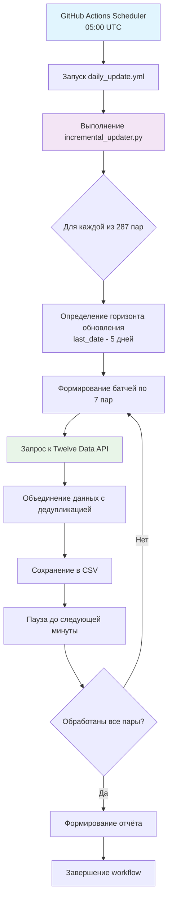

Создаю файл `/scripts/daily_update/README.md`:

# Система ежедневного инкрементального обновления данных AbsCur3

[← Назад к корневому README.md](../../README.md)

## 📋 Обзор

Система ежедневного инкрементального обновления предназначена для поддержания актуальности сырых данных валютных пар, необходимых для расчёта абсолютных курсов в проекте AbsCur3. Система работает полностью автоматически, выполняясь каждый день в заданное время.

**Ключевой принцип**: AbsCur3 — проект об **абсолютных валютных курсах**, а не публичный архив сырых парных котировок. Сырые данные являются промежуточным продуктом для внутренних расчётов.

## 🎯 Цели системы

1. **Автоматическое обновление**: Ежедневная загрузка новых данных для всех 287 валютных пар
2. **Целостность данных**: Перекрытие истории на 5 дней для выравнивания и коррекции
3. **Соблюдение лимитов**: Строгое соблюдение лимита API (8 запросов в минуту)
4. **Надёжность**: Устойчивость к ошибкам отдельных пар и сетевым проблемам
5. **Идемпотентность**: Повторные запуски не создают дубликатов

## 🏗️ Архитектура системы



## 🔧 Ключевые компоненты

### 1. Скрипт `incremental_updater.py`
Основной скрипт, выполняющий инкрементальное обновление данных. Наследует код из `historical_loader.py` и добавляет логику ежедневного обновления.

### 2. GitHub Actions Workflow
Автоматизированный пайплайн, запускающийся каждый день в 05:00 UTC (08:00 МСК). Расположен в `.github/workflows/daily_update.yml`.

### 3. Файл состояния `update_state.json`
JSON-файл в `data/raw/twelve_data/metadata/`, отслеживающий статус последнего запуска для улучшения отказоустойчивости.

## 📊 Логика обновления (детально)

### Определение горизонта обновления
Для каждой валютной пары система определяет период для загрузки:

```python
# Псевдокод логики определения дат
last_local_date = читаем_последнюю_дату_из_CSV()
start_date = last_local_date - timedelta(days=5)  # Перекрытие 5 дней
end_date = min(вчерашний_день, последняя_доступная_дата_API)

if start_date >= end_date:
    пропускаем_пару()  # Нет новых данных
else:
    загружаем_данные(start_date, end_date)
```

### Батчевая обработка и лимиты
Для соблюдения лимита API (8 запросов в минуту) используется стратегия батчей:

```mermaid
gantt
    title Распределение запросов (в часах:минутах)
    dateFormat  HH:mm
    axisFormat %H:%M
    
    section Батч 1
    Запросы к API : 00:00, 1m
    Пауза : 00:01, 59s
    
    section Батч 2
    Запросы к API : 00:01, 1m
    Пауза : 00:02, 59s
    
    section Батч 41
    Запросы к API : 00:40, 1m
    Пауза : 00:41, 59s
```



**Расчёт времени**: 287 пар ÷ 7 пар/мин = 41 минута (без учёта накладных расходов)

### Объединение и дедупликация данных
Новые данные объединяются с существующими по следующим правилам:
1. **Сортировка по дате** - все данные сортируются от старых к новым
2. **Дедупликация** - при конфликте записей с одинаковой датой приоритет отдаётся данным из **последнего успешного запроса**
3. **Идемпотентность** - повторный запуск не создаёт дубликатов

## 📁 Входные и выходные данные

### Входные данные
1. **Конфигурация**: `config/currencies.py` (список 287 валютных пар)
2. **Существующие данные**: CSV-файлы в `data/raw/twelve_data/pairs/`
3. **Ключ API**: Twelve Data API ключ (хранится в GitHub Secrets)
4. **Метаданные**: `earliest_dates.json` и `last_update.json`

### Выходные данные
1. **Обновлённые CSV-файлы**: Дополненные новыми строками в `data/raw/twelve_data/pairs/`
2. **Логи выполнения**: Детальный лог в stdout GitHub Actions
3. **Файл состояния**: `update_state.json` в `data/raw/twelve_data/metadata/`

## ⚙️ Настройка и запуск

### Локальный запуск (для тестирования)
Запуск должен производиться из **корневого каталога проекта** (`abscur3/`). Скрипт сам определит правильные пути.
```bash
# Из корня репозитория
python scripts/daily_update/incremental_updater.py
```

### Автоматический запуск
Система настроена на автоматический запуск через GitHub Actions:
- **Расписание**: Каждый день в 05:00 UTC
- **Ручной запуск**: Доступен через GitHub Actions UI
- **Таймаут**: 55 минут

### Настройка окружения
1. Установите зависимости: `pip install -r requirements.txt`
2. Файл `.env` уже существует в корне репозитория и содержит переменную `TWELVE_DATA_API_KEY`. Убедитесь, что он присутствует.
3. Для GitHub Actions добавьте секрет `TWELVE_DATA_API_KEY` в настройках репозитория (Settings → Secrets and variables → Actions)

## 🐛 Обработка ошибок

Система разработана с учётом устойчивости к ошибкам:

| Тип ошибки | Действие системы |
|------------|------------------|
| Сетевая ошибка | 3 попытки повтора с экспоненциальной задержкой |
| Ошибка API (429) | Пауза 60 секунд, повтор попытки |
| Ошибка отдельной пары | Пропуск пары, продолжение обработки остальных |
| Превышение времени | GitHub Actions прерывает выполнение через 55 минут |

## 📈 Мониторинг и отладка

### Логирование
Скрипт предоставляет детальное логирование:
- **INFO**: Основные этапы выполнения
- **WARNING**: Незначительные проблемы (пропуск пары и т.д.)
- **ERROR**: Критические ошибки
- **DEBUG**: Детальная отладочная информация

### Отчётность
После каждого запуска генерируется сводный отчёт:
- Количество обновлённых пар
- Общее количество новых записей
- Список пар с ошибками
- Время выполнения

## 🔗 Связанные компоненты

- **[Корневой README.md](../README.md)** - Общая документация проекта AbsCur3
- **[historical_loader.py](../initial_load/historical_loader.py)** - Исходный скрипт загрузки истории
- **[currencies.py](../../config/currencies.py)** - Конфигурация валютных пар

## 📝 Примечания

1. **Данные за сегодня** не загружаются, так как на момент запуска (05:00 UTC) торговый день может быть не завершён
2. **Перекрытие 5 дней** обеспечивает целостность данных и позволяет корректировать историю
3. **Случайное перемешивание** пар в батчах распределяет нагрузку на API
4. **Приоритет новым данным** при дедупликации позволяет исправлять ошибки в истории

---


[← Назад к корневому README.md](../../README.md)

