[file name]: scripts/daily_update/README.md
[file content begin]
# Система ежедневного инкрементального обновления данных AbsCur3

[← Назад к корневому README.md](../../README.md)

## 📋 Обзор

Система ежедневного инкрементального обновления предназначена для поддержания актуальности сырых данных валютных пар, необходимых для расчёта абсолютных курсов в проекте AbsCur3. Система работает полностью автоматически, выполняясь каждый день в заданное время.

**Ключевой принцип**: AbsCur3 — проект об **абсолютных валютных курсах**, а не публичный архив сырых парных котировок. Сырые данные являются промежуточным продуктом для внутренних расчётов.

## 🎯 Цели системы

1. **Автоматическое обновление**: Ежедневная загрузка новых данных для всех 296 валютных пар
2. **Целостность данных**: Перекрытие истории на 5 дней для выравнивания и коррекции
3. **Соблюдение лимитов**: Строгое соблюдение лимита API (8 запросов в минуту)
4. **Надёжность**: Устойчивость к ошибкам отдельных пар и сетевым проблемам
5. **Идемпотентность**: Повторные запуски не создают дубликатов

## 🏗️ Архитектура системы


## 🔧 Ключевые компоненты

### 1. Скрипт `incremental_updater.py`
Основной скрипт, выполняющий инкрементальное обновление данных. Наследует код из `historical_loader.py` и добавляет логику ежедневного обновления.

### 2. GitHub Actions Workflow
Автоматизированный пайплайн, запускающийся каждый день в 05:00 UTC (08:00 МСК). Расположен в `.github/workflows/daily_update.yml`.

### 3. Файл состояния `update_state.json`
JSON-файл в `data/metadata/`, отслеживающий статус последнего запуска для улучшения отказоустойчивости.

## 📊 Логика обновления (детально)

### Определение горизонта обновления
Для каждой валютной пары система определяет период для загрузки:

```python
# Псевдокод логики определения дат
last_local_date = читаем_последнюю_дату_из_CSV()
start_date = last_local_date - timedelta(days=5)  # Перекрытие 5 дней
end_date = min(вчерашний_день, последняя_доступная_дата_API)

if start_date >= end_date:
    пропускаем_пару()  # Нет новых данных
else:
    загружаем_данные(start_date, end_date)
```

### Батчевая обработка и лимиты
Для соблюдения лимита API (8 запросов в минуту) используется стратегия батчей:

```mermaid
gantt
    title Распределение запросов (в часах:минутах)
    dateFormat  HH:mm
    axisFormat %H:%M
    
    section Батч 1
    Запросы к API : 00:00, 1m
    Пауза : 00:01, 59s
    
    section Батч 2
    Запросы к API : 00:01, 1m
    Пауза : 00:02, 59s
    
    section Батч 43
    Запросы к API : 00:42, 1m
    Пауза : 00:43, 59s
```



**Расчёт времени**: 296 пар ÷ 7 пар/мин = 42.3 минуты ≈ **43 минуты** (без учёта накладных расходов)

### Объединение и дедупликация данных
Новые данные объединяются с существующими по следующим правилам:
1. **Сортировка по дате** - все данные сортируются от старых к новым
2. **Дедупликация** - при конфликте записей с одинаковой датой приоритет отдаётся данным из **последнего успешного запроса**
3. **Идемпотентность** - повторный запуск не создаёт дубликатов

## 📁 Входные и выходные данные

### Входные данные
1. **Конфигурация**: `config/currencies.py` (список 296 валютных пар)
2. **Существующие данные**: CSV-файлы в `data/raw/twelve_data/pairs/`
3. **Ключ API**: Twelve Data API ключ (хранится в GitHub Secrets)
4. **Метаданные**: `earliest_dates.json` и `last_update.json`

### Выходные данные
1. **Обновлённые CSV-файлы**: Дополненные новыми строками в `data/raw/twelve_data/pairs/`
2. **Логи выполнения**: Детальный лог в stdout GitHub Actions и файлы в `scripts/daily_update/logs/`
3. **Файл состояния**: `update_state.json` в `data/metadata/`

## 🚀 Начало работы

### 🔧 Локальная отладка и тестирование

#### 1. Подготовка окружения

```bash
# Активируйте виртуальное окружение
# (предполагается, что вы находитесь в корне проекта)
source .venv/bin/activate  # Linux/Mac
# или
.venv\Scripts\activate     # Windows

# Установите зависимости
pip install -r requirements.txt
```

#### 2. Проверка настроек API

Убедитесь, что файл `.env` в корне проекта содержит ключ API:
```bash
TWELVE_DATA_API_KEY=your_api_key_here
```

#### 3. Тестовый запуск с малым количеством пар

Для тестирования можно временно изменить функцию `load_currency_config()` в `incremental_updater.py`:

```python
# Временно для тестирования (добавьте в начало функции load_currency_config)
def load_currency_config():
    # Тестовый набор из 5 пар
    test_pairs = ["USD/RUB", "EUR/USD", "GBP/USD", "USD/JPY", "AUD/USD"]
    return test_pairs[:3]  # Только 3 пары для быстрого теста
```

#### 4. Запуск скрипта

```bash
# Из корня проекта (обязательно!)
python scripts/daily_update/incremental_updater.py
```

#### 5. Проверка результатов

После запуска проверьте:
- **Логи**: `scripts/daily_update/logs/update_*.log`
- **Данные**: `data/raw/twelve_data/pairs/*.csv` (должны обновиться)
- **Состояние**: `data/metadata/update_state.json` (статистика выполнения)

### ⚙️ Настройка GitHub Actions

#### 1. Добавление секретов в репозиторий

В настройках GitHub репозитория добавьте секреты:
1. Перейдите в **Settings → Secrets and variables → Actions**
2. Нажмите **New repository secret**
3. Добавьте секрет `TWELVE_DATA_API_KEY` с вашим ключом API

#### 2. Конфигурация workflow

Файл `.github/workflows/daily_update.yml` уже создан со следующей конфигурацией:

```yaml
name: Daily Data Update
on:
  schedule:
    - cron: '0 5 * * *'  # 05:00 UTC каждый день
  workflow_dispatch:      # Ручной запуск
jobs:
  update-raw-pairs:
    runs-on: ubuntu-latest
    timeout-minutes: 55   # Ограничение времени
    steps:
      - name: Checkout repository
        uses: actions/checkout@v4
      - name: Set up Python
        uses: actions/setup-python@v5
        with:
          python-version: '3.11'
      - name: Install dependencies
        run: pip install -r requirements.txt
      - name: Run incremental update
        env:
          TWELVE_DATA_API_KEY: ${{ secrets.TWELVE_DATA_API_KEY }}
        run: python scripts/daily_update/incremental_updater.py
      - name: Commit and push if changes
        run: |
          git config --local user.email "action@github.com"
          git config --local user.name "GitHub Action"
          git add data/raw/twelve_data/pairs/*.csv
          git add data/metadata/update_state.json
          git diff --quiet && git diff --staged --quiet || git commit -m "Auto-update: daily data refresh [skip ci]"
          git push
```

#### 3. Первый запуск workflow

1. Закоммитьте все изменения в репозиторий
2. Перейдите в **Actions → Daily Data Update**
3. Нажмите **Run workflow** для первого ручного запуска
4. Мониторьте выполнение в реальном времени

## 📈 Мониторинг и отладка

### Просмотр логов в GitHub Actions

- **Журнал выполнения**: Просматривайте логи каждого шага в реальном времени
- **Артефакты**: При необходимости можно настроить сохранение логов как артефактов
- **Уведомления**: Настройте email-уведомления о сбоях workflow

### Отладка распространённых проблем

#### 1. Превышение лимита времени (timeout)
- **Симптом**: Workflow прерывается через 55 минут
- **Решение**: Проверьте, что паузы между батчами работают корректно, уменьшите количество пар для тестирования

#### 2. Ошибки API ключа
- **Симптом**: `API ключ не найден` в логах
- **Решение**: Проверьте, что секрет `TWELVE_DATA_API_KEY` установлен в репозитории

#### 3. Ошибки чтения/записи файлов
- **Симптом**: `Permission denied` или `File not found`
- **Решение**: Убедитесь, что пути к файлам корректны, проверьте права доступа

### Анализ файла состояния

После каждого запуска создаётся файл `data/metadata/update_state.json` с детальной статистикой:

```json
{
  "timestamp": "2026-01-29T12:00:00",
  "total_pairs": 296,
  "total_api_requests": 42,
  "yesterday_date": "2026-01-28",
  "statistics": {
    "updated": 45,
    "already_current": 230,
    "no_new_data": 15,
    "failed": 6,
    "total_new_rows": 225
  }
}
```

## 🔄 Жизненный цикл обновления

1. **05:00 UTC** - GitHub Actions автоматически запускает workflow
2. **Загрузка конфигурации** - Чтение списка из 296 валютных пар
3. **Случайное перемешивание** - Пары перемешиваются для равномерной нагрузки
4. **Батчевая обработка** - По 7 пар в минуту с паузой до следующей минуты
5. **Для каждой пары**:
   - Определение последней локальной даты из CSV
   - Расчёт диапазона: `last_date - 5 дней → yesterday`
   - Загрузка данных из API
   - Объединение с существующими данными (дедупликация)
6. **Сохранение** - Обновлённые CSV файлы
7. **Фиксация изменений** - Автоматический коммит и пуш обновлений
8. **Формирование отчёта** - Сохранение статистики в `update_state.json`

## 🐛 Обработка ошибок

Система разработана с учётом устойчивости к ошибкам:

| Тип ошибки | Действие системы |
|------------|------------------|
| **Сетевая ошибка** | 3 попытки повтора с экспоненциальной задержкой |
| **Ошибка API (429)** | Пауза 60 секунд, повтор попытки |
| **Ошибка отдельной пары** | Пропуск пары, продолжение обработки остальных |
| **Превышение времени** | GitHub Actions прерывает выполнение через 55 минут |
| **Отсутствие локальных данных** | Пара пропускается (требуется первоначальная загрузка) |

## ⏱️ Оценка времени выполнения

Для полного обновления всех пар:
- **296 пар** ÷ **7 пар/мин** = **42.3 минуты** (основная обработка)
- **Плюс** накладные расходы: ~5-10 минут
- **Итого**: 47-52 минуты (в пределах 55-минутного лимита GitHub Actions)

## 📝 Важные примечания

### Особенности реализации
1. **Данные за сегодня** не загружаются, так как на момент запуска (05:00 UTC) торговый день может быть не завершён
2. **Перекрытие 5 дней** обеспечивает целостность данных и позволяет корректировать исторические значения
3. **Случайное перемешивание** пар предотвращает постоянный порядок запросов к API
4. **Приоритет новым данным** при дедупликации позволяет исправлять ошибки в истории

### Рекомендации по эксплуатации
1. **Перед первым запуском** обязательно протестируйте на локальной машине с 5-10 парами
2. **Мониторьте первые запуски** через GitHub Actions UI для выявления проблем
3. **Проверяйте `update_state.json`** для анализа статистики выполнения
4. **Настройте уведомления** о сбоях workflow в настройках репозитория

## 🔗 Связанные компоненты

- **[Корневой README.md](../../README.md)** - Общая документация проекта AbsCur3
- **[historical_loader.py](../initial_load/historical_loader.py)** - Исходный скрипт загрузки истории
- **[currencies.py](../../config/currencies.py)** - Конфигурация валютных пар
- **[data/README.md](../../data/README.md)** - Описание структуры данных
- **[config/README.md](../../config/README.md)** - Описание конфигурационных файлов

---

*Последнее обновление: 2026-01-29*  
*Добавлена документация по локальной отладке и настройке GitHub Actions*

[← Назад к корневому README.md](../../README.md)
[file content end]